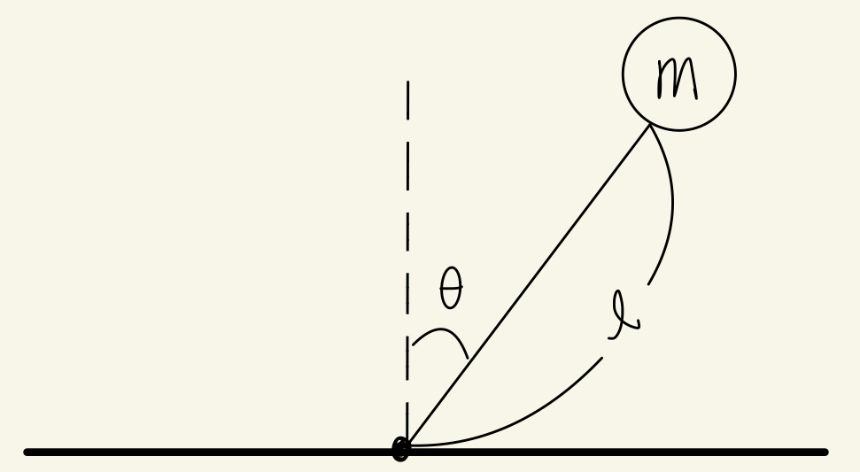

# Pendulum Control

Single inverted pendulum simulation and control using the PyBullet physics engine.


## System Modeling


The model is linearized at $\theta \approx 0$ for LQR controller.

$$
\dot{x} = A x + B u, \quad
x = \begin{bmatrix}\theta \\ \dot{\theta}\end{bmatrix}, \\
 u = \tau
$$

$$
A = \begin{bmatrix}
0 & 1 \\
\frac{g}{L} & 0
\end{bmatrix},
\qquad
B = \begin{bmatrix}
0 \\
\frac{1}{m L^2}
\end{bmatrix}.
$$

## Project Structure

```
single_inverted_pendulum/
├── model.py          # System parameters and model definition
├── controller.py     # Control algorithms (PD control, LQR placeholder)
└── simulation.py     # PyBullet physics simulation
```

## Components

### Model (`model.py`)
Defines the physical parameters of the pendulum system:
- **rod_length**: Length of the pendulum rod (1.0 m)
- **ball_radius**: Radius of the ball at the end (0.05 m)
- **ball_mass**: Mass of the ball (1.0 kg)

### Controller (`controller.py`)
Implements control strategies:
- **PD Control**: Proportional-Derivative controller with tunable gains (Kp, Kd)
- **LQR**: Linear Quadratic Regulator (placeholder for future implementation)
- **MPC**: Will be implemented shortly

### Simulation (`simulation.py`)
PyBullet-based physics simulation

## Dependencies

- `pybullet`: Physics simulation engine
- `numpy`: Calculation

## Getting Started

1. Install dependencies:
   ```bash
   pip install pybullet
   pip install numpy
   ```

2. Run the simulation:
   ```bash
   python single_inverted_pendulum/simulation.py
   ```
